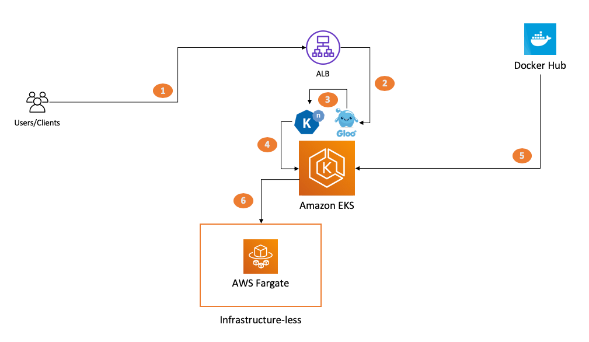

### Background

The industry is full of OSS projects that abstract a container orchestrator interface and provide the illusion of a FaaS (Function as a Service) experience. 

A good example of this is [OpenFaaS](https://www.openfaas.com/). As of late OpenFaaS has evolved to support AWS Fargate as a polyglot and orchestrator-agnostic serverless platform to run containers at scale. Today you can run OpenFaaS on [EKS/Fargate](https://blog.alexellis.io/nodeless-openfaas-with-aws-eks-and-fargate/) as well as [ECS/Fargate](https://www.openfaas.com/blog/openfaas-on-fargate/). If you are not familiar with AWS Fargate [this blog post about its role in the container world](https://aws.amazon.com/blogs/containers/the-role-of-aws-fargate-in-the-container-world/) may be helpful. 

This repo will outline the instructions on how to setup [Knative](https://knative.dev/) (a Google owned OSS project) on top of EKS/Fargate. Given Knative is limited in scope to abstract Kubernetes only clusters, it cannot be used with other container orchestrators. 


### Why EKS/Fargate and not just EKS/EC2?

Because Amazon EKS is built on the premise of using standard upstream Kubernetes, setting up Knative on EKS/EC2 is trivial. However a solution that provides a FaaS orchestration abstraction without having to deal with the mechanics of dealing with a cluster of virtual machines is appealing for a set of users. If you want more background about what problems EKS/Fargate can solve [this re:Invent session](https://www.youtube.com/watch?v=m-3tMXmWWQw) is a good start. 

In addition to not managing an infrastructure, AWS Fargate provides the foundational building blocks for a `scale to zero` experience. Knative is one of the tools that can enable that.

#### High level architecture

This repo allows the reader to setup the following architecture:




### Getting started 

#### Getting ready and pre-requisites  

The procedure below will setup Knative with Gloo support on an EKS control plane with no worker nodes. If a user was to setup Knative with Gloo on an EKS cluster with EC2 worker nodes [these instructions](https://knative.dev/docs/install/knative-with-gloo/) would suffice. 

Because Fargate introduces some peculariaties there is a need to shadow those instructions while adapting them to the requirements. 

As a prerequisite, you need to have an AWS account and a client environment with a series of tools (e.g. proper AWS credentials, the AWS CLI, kubectl, eksctl, etc.). The instructions below assume the usage of [eksutils](https://github.com/mreferre/eksutils) albeit you can achieve the same result using any environment with the proper tools installed. 

The starting point for us is a Cloud9 instance with proper administrative IAM credentials configured. At the prompt launch: 
```
docker run -it --rm --network host -v $HOME/.aws:/root/.aws -v $HOME/.kube:/root/.kube -v $HOME/environment:/environment -v /var/run/docker.sock:/var/run/docker.sock mreferre/eksutils:latest
```

#### Creating and configuring the EKS cluster   

Inside the `eksutils` shell, we will set up a few variables we will need later:
```
export REGION = us-east-1
export CLUSTERNAME = eksfargate
```

Now we will create an EKS cluster with some default Fargate profiles activated. This will take a few minutes: 
```
eksctl create cluster --name=$CLUSTERNAME --region=$REGION --fargate  
```

Because Knative and Gloo will deploy into specific namespaces (namely `gloo-system` and `knative-serving`) we need to explicitly setup a Fargate profile that matches them and allow the setup to start pods on Fargate: 
```
eksctl create fargateprofile --namespace gloo-system --cluster $CLUSTERNAME --name fp-gloo-system
eksctl create fargateprofile --namespace knative-serving --cluster $CLUSTERNAME --name fp-knative-serving
```

#### Creating and configuring the ALB ingress   

The Knative with Gloo support setup routines deploy a Classic Load Balancer on a traditional EKS deployment. Because EKS/Fargate can't work with the CLB (because there are no EC2 instances) we need to modify the setup to leverage the Application Load Balancer. 

First we need to deploy the ALB ingress controller. These commands are based on the [Amazon EKS documentation](https://docs.aws.amazon.com/eks/latest/userguide/alb-ingress.html) that covers how to use ALB (specifically in the context of Fargate). 
```
eksctl utils associate-iam-oidc-provider --region $REGION --cluster $CLUSTERNAME --approve
curl -sS https://raw.githubusercontent.com/kubernetes-sigs/aws-alb-ingress-controller/v1.1.4/docs/examples/iam-policy.json > albiampolicy.json && aws iam create-policy --policy-name ALBIngressControllerIAMPolicy --policy-document file://albiampolicy.json
kubectl apply -f https://raw.githubusercontent.com/kubernetes-sigs/aws-alb-ingress-controller/v1.1.4/docs/examples/rbac-role.yaml
eksctl create iamserviceaccount --region $REGION --name alb-ingress-controller --namespace kube-system --cluster $CLUSTERNAME --attach-policy-arn arn:aws:iam::693935722839:policy/ALBIngressControllerIAMPolicy --override-existing-serviceaccounts --approve
kubectl apply -f https://raw.githubusercontent.com/kubernetes-sigs/aws-alb-ingress-controller/v1.1.4/docs/examples/alb-ingress-controller.yaml
```

At this point the ingress needs to be edited to inject the information require for it to work properly. To do so run the following command:
```
kubectl edit deployment.apps/alb-ingress-controller -n kube-system
```

Add the cluster name, vpc id and region of your own setup: 
```
    spec:
      containers:
      - args:
        - --ingress-class=alb
        - --cluster-name=<name of the cluster>
        - --aws-vpc-id=<vpc id>
        - --aws-region=<region>
```

Save and exit. 

#### Preparing the assets for the Knative and Gloo setup   

The standard setup command (`glooctl install knative`) is a black box and installs Knative and Gloo leveraging the Classic Load Balancer. Because EKS/Fargate doesn't support it, we need to find a way to inject the ALB instead. In addition to this, we need to customize a number of other things in the assets.  

*Note*: this repo ships with the two assets you need to deploy Knative and Gloo on EKS/Fargate. They are the `knative-gloo-fargate-first-batch.yaml` file and `knative-gloo-fargate-second-batch.yaml` file and are located in the [assets](./assets/) folder. If you are interested in understand how these assets have been generated you can read [this deep dive](./assets/README.md) so that you can yourself re-create them from scratch (if you ever need to). If you just want to se


#### Deploying the assets and setup Knative and Gloo

We are now at the point where we can run the Knative and Gloo assets. 

Run the following command: 
```
kubectl apply -f knative-gloo-fargate-first-batch.yaml
```

Wait a few seconds (to avoid race conditions) and the run the following command:
```
kubectl apply -f knative-gloo-fargate-second-batch.yaml
```


#### Customizing the domain the application will be exposed to

Inspect the name of the ALB ingress that has been initialized:
```
sh-4.2# kubectl get ingress -A
NAMESPACE     NAME                     HOSTS   ADDRESS                                                                  PORTS   AGE
gloo-system   knative-external-proxy   *       b497c7f1-gloosystem-knativ-677e-1291493325.eu-west-1.elb.amazonaws.com   80      4m10s
sh-4.2# 
```

Customize the domain in config-map with this command:
```
kubectl edit cm config-domain --namespace knative-serving
```

Add the ALB address in the position below:
```
# Please edit the object below. Lines beginning with a '#' will be ignored,
# and an empty file will abort the edit. If an error occurs while saving this file will be
# reopened with the relevant failures.
#
apiVersion: v1
data:
  b497c7f1-gloosystem-knativ-677e-1291493325.eu-west-1.elb.amazonaws.com: ""
  _example: |
    ################################
    #                              #
    #    EXAMPLE CONFIGURATION     #
    #                              #
    ################################
```

Save and exit.

At this point you should have all the plumbing ready to go. Time to move to deploying a demo workload. You have the option of deploying your demo workload using a `scale to zero` strategy or deploying the same demo workload using a strategy to avoid cold starts. 


#### Deploying an application that scales to zero on Fargate 

The characteristic of this demo application deployment is that it scales to zero after a few seconds the endpoint doesn't get solicited. This means that the next call (after having scaled to zero) will experience a cold start and take a minute or so to respond to the first solicitation.   

Create this `mywebapp-scales-to-zero.yaml` file: 

```
apiVersion: serving.knative.dev/v1
kind: Service
metadata:
  name: mywebapp-scalestozero
  namespace: default
spec:
  template:
    spec:
      containers:
        - image: mreferre/nginx-custom-site:0.2.1
          env:
            - name: INDEX_HTML_CONTENT
              value: "This is my web app running on Knative/Fargate that scales to zero"
            - name: HTTP_PORT
              value: "8080"
      timeoutSeconds: 300
```

Apply the file:
```
kubectl apply -f mywebapp-scales-to-zero.yaml
```

Inspect the Knative service deployed. Not it may take a minute or so to become `READY`: 
```
sh-4.2# kubectl get ksvc mywebapp-scalestozero
NAME                    URL                                                                                                           LATESTCREATED                 LATESTREADY                   READY   REASON
mywebapp-scalestozero   http://mywebapp-scalestozero.default.b497c7f1-gloosystem-knativ-677e-1291493325.eu-west-1.elb.amazonaws.com   mywebapp-scalestozero-jqmjj   mywebapp-scalestozero-jqmjj   True    
sh-4.2# 
```

Take the URL and decompose it with a -H header and the ALB FQDN like this:
```
sh-4.2# curl -H 'Host: mywebapp-scalestozero.default.b497c7f1-gloosystem-knativ-677e-1291493325.eu-west-1.elb.amazonaws.com' http://b497c7f1-gloosystem-knativ-677e-1291493325.eu-west-1.elb.amazonaws.com
This is my nginx running on Knative/Fargate that scales to zero
sh-4.2# 
```

#### Deploying an application without cold starts 

The characteristic of this demo application deployment is that it doesn't scale to zero because it will always have, at a minimum, one pod up and running to avoid cold starts. 

Create this `mywebapp-no-cold-starts.yaml` file: 

```
apiVersion: serving.knative.dev/v1
kind: Service
metadata:
  name: mywebapp-nocoldstarts
  namespace: default
spec:
  template:
    metadata:
     annotations:
      autoscaling.knative.dev/minScale: "1"
    spec:
      containers:
        - image: mreferre/nginx-custom-site:0.2.1
          env:
            - name: INDEX_HTML_CONTENT
              value: "This is my web app running on Knative/Fargate with no cold starts"
            - name: HTTP_PORT
              value: "8080"
      timeoutSeconds: 300
```

Apply the file:
```
kubectl apply -f mywebapp-no-cold-starts.yaml
```

Inspect the Knative service deployed. Not it may take a minute or so to become `READY` the first time: 
```
sh-4.2# kubectl get ksvc mywebapp-nocoldstarts
NAME                    URL                                                                                                           LATESTCREATED                 LATESTREADY                   READY   REASON
mywebapp-nocoldstarts   http://mywebapp-nocoldstarts.default.b497c7f1-gloosystem-knativ-677e-1291493325.eu-west-1.elb.amazonaws.com   mywebapp-nocoldstarts-dlrgg   mywebapp-nocoldstarts-dlrgg   True    
sh-4.2# 
```

Take the URL and decompose it with a -H header and the ALB FQDN like this:
```
sh-4.2# curl -H 'Host: mywebapp-nocoldstarts.default.b497c7f1-gloosystem-knativ-677e-1291493325.eu-west-1.elb.amazonaws.com' http://b497c7f1-gloosystem-knativ-677e-1291493325.eu-west-1.elb.amazonaws.com
This is my web app running on Knative/Fargate with no cold starts
sh-4.2# 
```


